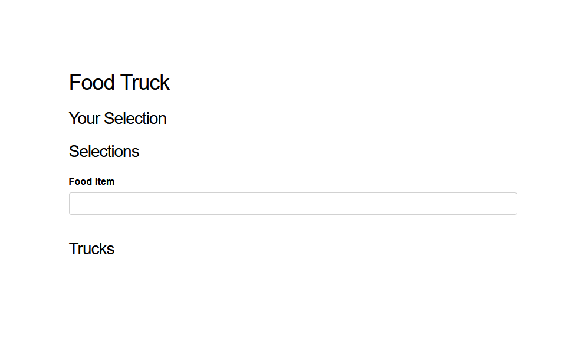

# FoodTruck

To start application:

  * Install dependencies with `mix deps.get`
  * Create and migrate your database with `mix ecto.setup`
  * Start Phoenix endpoint with `mix phx.server` or inside IEx with `iex -S mix phx.server`

Visit [`localhost:4000`](http://localhost:4000).

## Using the application

The application front end is a Phoenix LiveView app.  It uses standard Phoenix generated auth.

You will first have to register a user or log in if you have already registered. You will then be taken to the single page LiveView app.

### Initial Screen - Search for food items

Hopefully fairly intuitive from here.

## Code features

 * On startup preloads food items from the San Francisco food truck api into a genserver in `FoodTruck.Trucks.FoodItems` for fast search suggestions.
 * Uses `Phoenix.PubSub` to push updates over sockets.
 * Uses [ExVCR](https://github.com/parroty/exvcr) for integration type testing that can be run without external interaction until previously recorded cassettes are deleted.